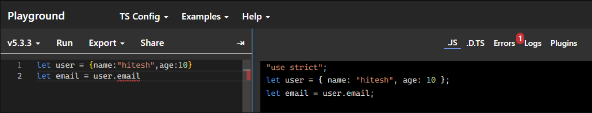
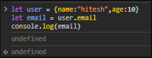
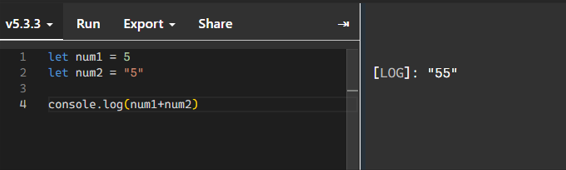
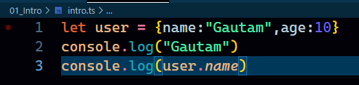
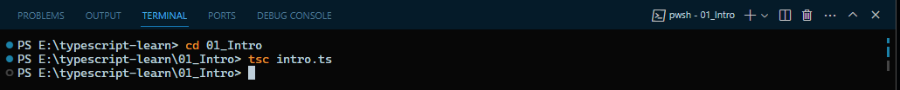
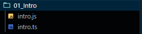
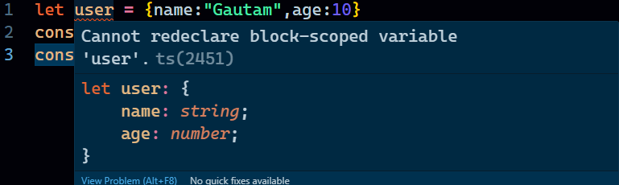
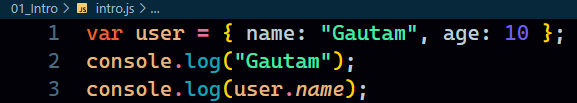

## Table of Contents

## Introduction to Typescript
- Typescript is a superset of JS. But It's not like it is adding more features to javascript. It just allows us to write JS in a precise manner so that our code faces a lot less errors in run time.
- If there is an error, It is already being displayed to us while writing the code.
- All the code we write in typescript is finally compiled into Javscript.
- Even if our code editor is displaying us errors in form of squiggly lines, we can still compile it into JS and it might work.

## Why to learn Typescript
1. TS is not about inventing JS. We write JS with a little bit more accurate behaviour.
2. Don't use typescript, unless if your project is 2 files long.
3. Don't use it for fanciness. Use it to make your code less error prone.
4. Typescript is all about **TYPE SAFETY**. Nothing More.

### Exploring Type Safety. Odd behaviour of Javascript

Consider the following code

```
    console.log(2+"2")
    console.log(null+2)
    console.log(undefined+2)
```

Output:

> 22

> 2

> NaN

We can see the odd behaviour, a number and string is being adde, null is added to a number and so on. We can avoid this using Typescript.

## Typescript is not what you think
### What typescript does?
- **Static Checking** - Only one job that Typescript has got for us. Analyse the code as we type it.
      - It means whenever we are writing the code, the parser of the language or the entire syntax of the language is constantly being analysed by the IDEs. But Not in the case of Javascript. And when the code executes in the browser or in any engine like node, then only the errors are thrown at our face.
      - for ex, I am trying to acces an object that has not been defined, if something can analyse my code and tell me that it has not been defined, then it is much more easier.
      - It just checks and informs that we might be doing something wrong, still we may export the entire code in JS and that may run as well.

- **More code in TS** - But it's worth it.

### How it works?
- .ts or .tsx is converted it to .js
- TS is a development too. Our project in production still runs JS.

### Exploring Typescript
- Go to [typescript lang playground](https://www.typescriptlang.org/play)
- To write some code

  

- In the left hand side we have written TS. As we can see, when we try to access a property that is not present inside the object, TS gives us a squiggly line showing error, but we can notice that in right hand side, it gets converted to Javascript just fine.
- This is what Typescript does.
- In Js we don't get any error while writing and even when we run this in broswer engine, we will get `undefined` and not an error. That is the advantage of Javascript.

  

- Another example

  

- Here we see there is no error shown at all. The code gets executed just fine.

## Installing Typescript

- Using it for learning and Using it in a project are two different ways.
- The first one is a global system install. Good for learning concepts.
- But when we use it in our project, may be react, there and additional typescript config file is required to set things up.
- To install we first need to have `node` installed.

### Core Global Installation
- npm install -g typescript

### In Projects
- npm install typescript --save-dev

### Check version after installing
- `tsc -v`

### To use Typescript
- Create files with `.ts` extension. `.tsx` if working with components in projects.

### Creating and Converting .ts into .js
- `intro.ts`

    

- `tsc intro.ts` in the terminal to convert it to Javascript

    

- A Javascript file is created with the same name

    

- The moment we go to our `js` file and keep it opened. A red line will appear in the `.ts` file that we wrote.
  
    

- We will discuss this later, what is this issue.
- But the compilation goes ahead. 
- `intro.js`
  
  