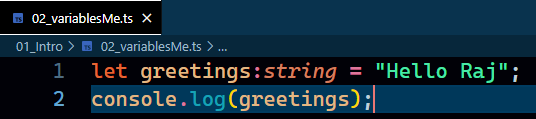
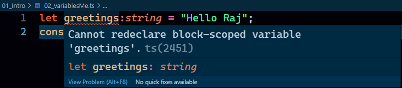
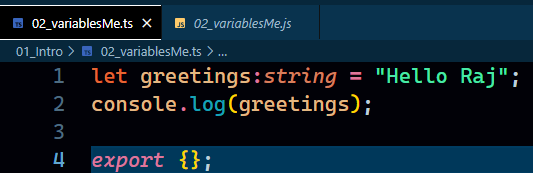
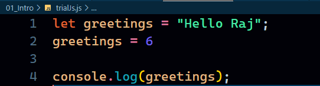
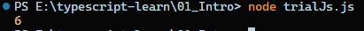
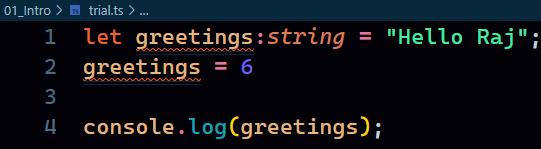
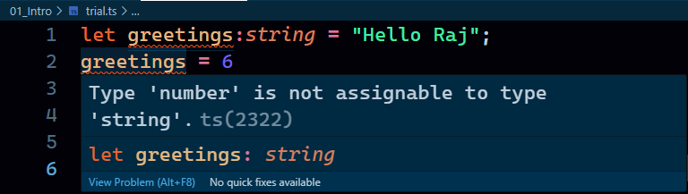

## Table of Contents

### Types
- Number
- String
- Boolean
- Null
- Undefined
- Void
- Object
- Array
- Tuples
- ...
- **Any** - If we are using `any` in our code, we are intentionally making our code more vulnerable.
- **Never**
- **Unknown**

### Situations
- A function accepts 2 numbers
- A function returns a string

### Syntax
- `let variableName:type = value`
- All types are lower case.
- value is optional
- `02_variablesMe.ts`
  
  
  
- In the terminal `tsc 02_variablesMe.ts`
- `02_variablesMe.js` is created.
  
  

- But again, when we go back to out .ts file. We will have a red line.
  
  

- Temporary fix for this error.
- Add `export {}` at the end of the .ts file.
- No red line.
  
  

### How this type helps us to write better code
- **In Javascript**
  
  

- In this code we have created a variable and assigned a string value to it and then we assigned an integer to it. There is no error shown.
- And when we run it, it even runs without any problem.
  
  

- **In Typescript**
  
  

- It shows us red line and gives us error.
  
  