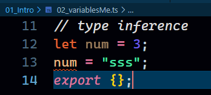

### String, Number, Boolean and Type Inference
```
//string
let greetings:string = "Hello Raj";
console.log(greetings);

//number
let userId:number = 223344;

//boolean
let isLoggedIn:boolean =false;

export {};
```

### Type Inference
- TypeScript has a powerful type inference system that allows the compiler to automatically determine the types of variables based on their usage. This helps reduce the need for explicit type annotations in many cases. Here are some examples of type inference in TypeScript:
```
let x = 10; // TypeScript infers x as number
let message = "Hello, TypeScript!"; // TypeScript infers message as string
```



- No need to explicity tell using colon and value that num is a number. TS automatically identifies it and it still gives red line unlike simple Javascript. No need to overkill the Typescript.
- So, we shouldn't be doing obvious things. There are time and places where we need to tell explicitly which we will see as we proceed.