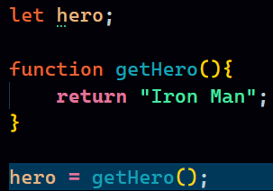
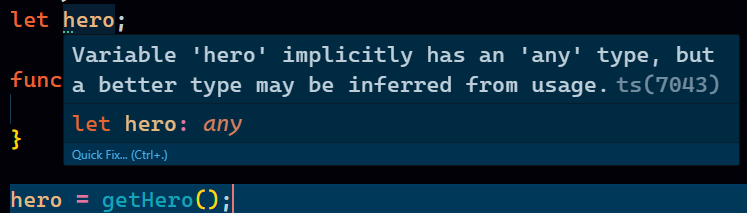
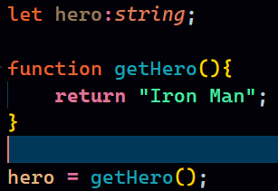
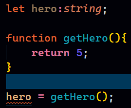

 ## Don't use `any` in Typescript
 - This is the usual keyword that people use to get away from the syntax of typescript.
 - TypeScript has a special type, any, that you can use whenever you don’t want a particular value to cause typechecking errors.
 - When you don’t specify a type, and TypeScript can’t infer it from context, the compiler will typically default to any.
 - for example: A non assigned variable, a function returning a string, returned value assigned to variable.

    
- If we hover over our variable:
  
  

- Right now we can return any type of value and there will  be no errors.
- To make it a better code we can explicitly tell the type using colon and value. This is where explicitly specifying the value is not overkill of Typescript.
  
  

- And now the variable will only accept String values.
- Red line when tried to return a number.

  